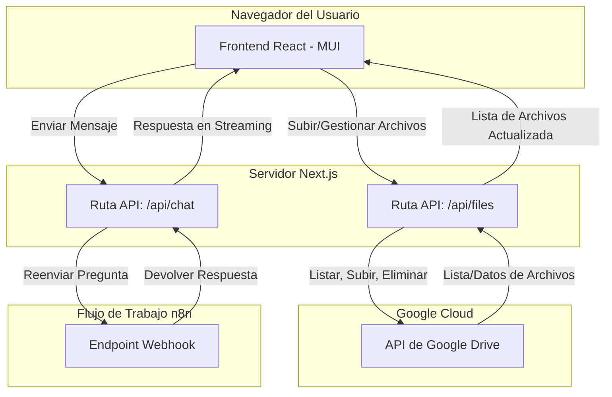

# Chatea con tus Documentos

Esta es una aplicación web que permite a los usuarios subir sus documentos e interactuar con ellos a través de una interfaz de chat. La aplicación utiliza un modelo de Generación Aumentada por Recuperación (RAG) a través de un flujo de trabajo de n8n para proporcionar respuestas basadas en el contenido de los documentos subidos.

## Características

- **Carga Segura de Archivos:** Interfaz de arrastrar y soltar para subir hasta 3 archivos.
- **Integración con Google Drive:** Los archivos se almacenan de forma segura en una carpeta designada de Google Drive.
- **Gestión de Archivos:** Lista, previsualiza y elimina archivos directamente desde la interfaz de usuario web.
- **Chat Interactivo:** Una interfaz de chat en tiempo real para hacer preguntas sobre los documentos.
- **Respuestas Impulsadas por IA:** Se conecta a un flujo de trabajo personalizado de n8n para obtener respuestas inteligentes y conscientes del contexto.
- **Gestión Segura de Credenciales:** Las claves API y la información sensible se almacenan en variables de entorno, no en el código.
- **UI/UX Moderna:** Construida con Material-UI para una experiencia de usuario limpia, atractiva y responsiva con animaciones e indicadores de carga.

## Pila Tecnológica

- **Framework:** [Next.js](https://nextjs.org/) (React & Node.js)
- **Librería UI/UX:** [Material-UI (MUI)](https://mui.com/)
- **Carga de Archivos:** [React Dropzone](https://react-dropzone.js.org/)
- **API Backend:** [Next.js API Routes](https://nextjs.org/docs/app/building-your-application/routing/route-handlers)
- **Almacenamiento de Archivos:** [Google Drive API](https://developers.google.com/drive)
- **Lenguaje:** [TypeScript](https://www.typescriptlang.org/)

## Diagrama de Arquitectura

El siguiente diagrama ilustra el flujo de información entre el usuario, la aplicación y los servicios de backend.



## Estructura del Proyecto

El proyecto sigue una estructura estándar de Next.js con el App Router.

```
rag-app/
├── src/
│   ├── app/
│   │   ├── api/
│   │   │   ├── files/       # Rutas API para la gestión de archivos
│   │   │   └── chat/        # Ruta API para el chat
│   │   ├── components/    # Componentes React reutilizables (Chat, Dropzone, FileList)
│   │   ├── layout.tsx
│   │   └── page.tsx       # Componente principal de la página
│   └── lib/             # Funciones de ayuda, cliente de Google Drive
├── public/            # Activos estáticos
├── .env.local.example # Ejemplo de variables de entorno
├── next.config.mjs
├── package.json
└── README.md
```

## Primeros Pasos

### Prerrequisitos

- Node.js (v18 o posterior)
- npm
- Un proyecto de Google Cloud Platform con la API de Drive habilitada.
- Un flujo de trabajo de n8n con un webhook activo.

### Instalación y Configuración

1.  **Clonar el repositorio:**
    ```bash
    git clone <repository-url>
    cd rag-app
    ```

2.  **Instalar dependencias:**
    ```bash
    npm install
    ```

3.  **Configurar variables de entorno:**
    Crea un archivo llamado `.env.local` en la raíz del proyecto y añade las siguientes variables. Usa `.env.local.example` como plantilla.
    ```
    # Credenciales de la API de Google Drive
    GOOGLE_CLIENT_ID=tu-client-id
    GOOGLE_CLIENT_SECRET=tu-client-secret
    GOOGLE_REFRESH_TOKEN=tu-refresh-token
    GOOGLE_DRIVE_FOLDER_ID=tu-folder-id

    # Flujo de Trabajo n8n
    N8N_WEBHOOK_URL=tu-n8n-webhook-url
    ```

4.  **Ejecutar el servidor de desarrollo:**
    ```bash
    npm run dev
    ```

Abre [http://localhost:3000](http://localhost:3000) en tu navegador para ver el resultado.