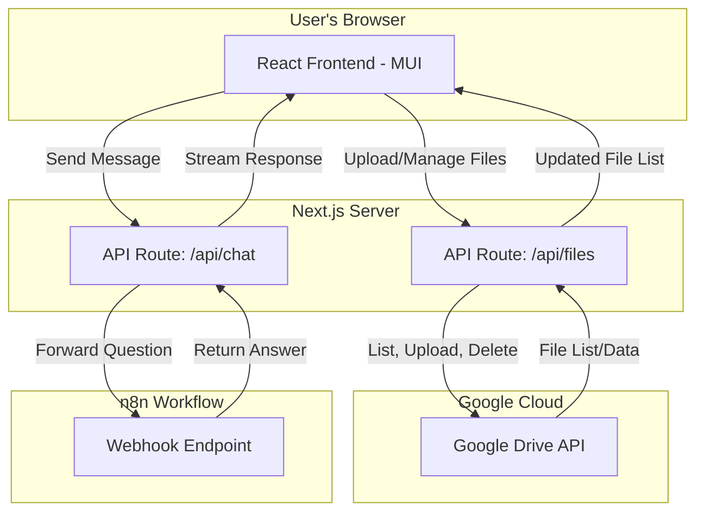

# Chat With Your Documents

This is a web application that allows users to upload their documents and interact with them through a chat interface. The application leverages a Retrieval-Augmented Generation (RAG) model via an n8n workflow to provide answers based on the content of the uploaded documents.

## Features

- **Secure File Upload:** Drag-and-drop interface to upload up to 3 files.
- **Google Drive Integration:** Files are securely stored in a designated Google Drive folder.
- **File Management:** List, preview, and delete files directly from the web UI.
- **Interactive Chat:** A real-time chat interface to ask questions about the documents.
- **AI-Powered Answers:** Connects to a custom n8n workflow to get intelligent, context-aware answers.
- **Secure Credential Management:** API keys and sensitive information are stored in environment variables, not in the code.
- **Modern UI/UX:** Built with Material-UI for a clean, attractive, and responsive user experience with animations and loading indicators.

## Technology Stack

- **Framework:** [Next.js](https://nextjs.org/) (React & Node.js)
- **UI/UX Library:** [Material-UI (MUI)](https://mui.com/)
- **File Uploads:** [React Dropzone](https://react-dropzone.js.org/)
- **Backend API:** [Next.js API Routes](https://nextjs.org/docs/app/building-your-application/routing/route-handlers)
- **File Storage:** [Google Drive API](https://developers.google.com/drive)
- **Language:** [TypeScript](https://www.typescriptlang.org/)

## Architecture Diagram

The following diagram illustrates the flow of information between the user, the application, and the backend services.



## Project Structure

The project follows a standard Next.js structure with the App Router.

```
rag-app/
├── src/
│   ├── app/
│   │   ├── api/
│   │   │   ├── files/       # API routes for file management
│   │   │   └── chat/        # API route for the chat
│   │   ├── components/    # Reusable React components (Chat, Dropzone, FileList)
│   │   ├── layout.tsx
│   │   └── page.tsx       # Main page component
│   └── lib/             # Helper functions, Google Drive client
├── public/            # Static assets
├── .env.local.example # Example for environment variables
├── next.config.mjs
├── package.json
└── README.md
```

## Getting Started

### Prerequisites

- Node.js (v18 or later)
- npm
- A Google Cloud Platform project with the Drive API enabled.
- An n8n workflow with an active webhook.

### Installation & Setup

1.  **Clone the repository:**
    ```bash
    git clone <repository-url>
    cd rag-app
    ```

2.  **Install dependencies:**
    ```bash
    npm install
    ```

3.  **Set up environment variables:**
    Create a file named `.env.local` in the root of the project and add the following variables. Use `.env.local.example` as a template.
    ```
    # Google Drive API Credentials
    GOOGLE_CLIENT_ID=your-client-id
    GOOGLE_CLIENT_SECRET=your-client-secret
    GOOGLE_REFRESH_TOKEN=your-refresh-token
    GOOGLE_DRIVE_FOLDER_ID=your-folder-id

    # n8n Workflow
    N8N_WEBHOOK_URL=your-n8n-webhook-url
    ```

4.  **Run the development server:**
    ```bash
    npm run dev
    ```

Open [http://localhost:3000](http://localhost:3000) with your browser to see the result.